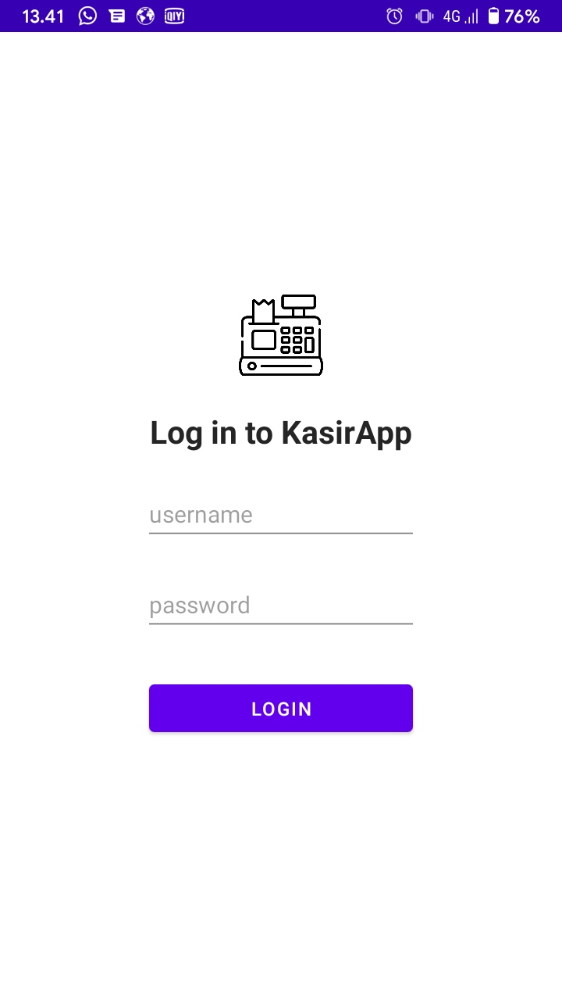
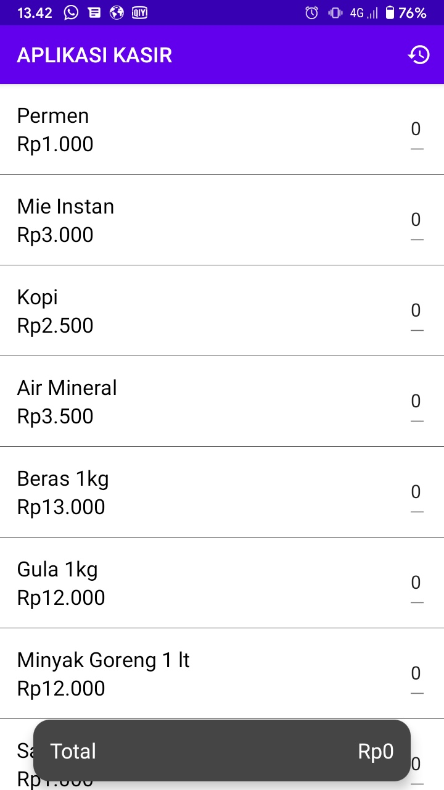
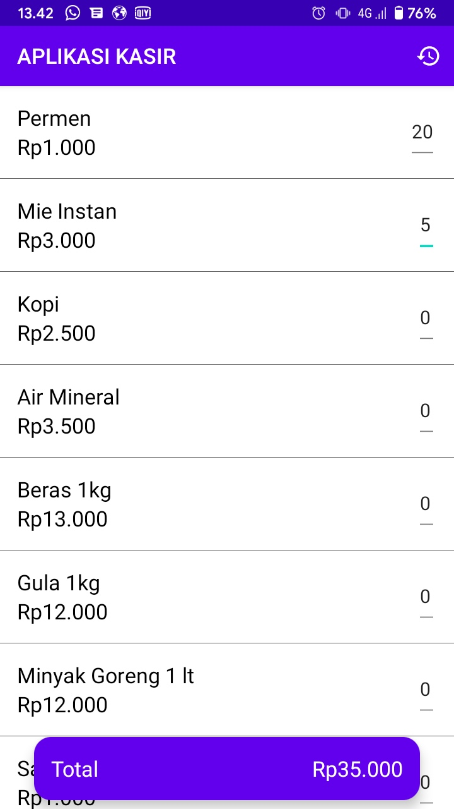
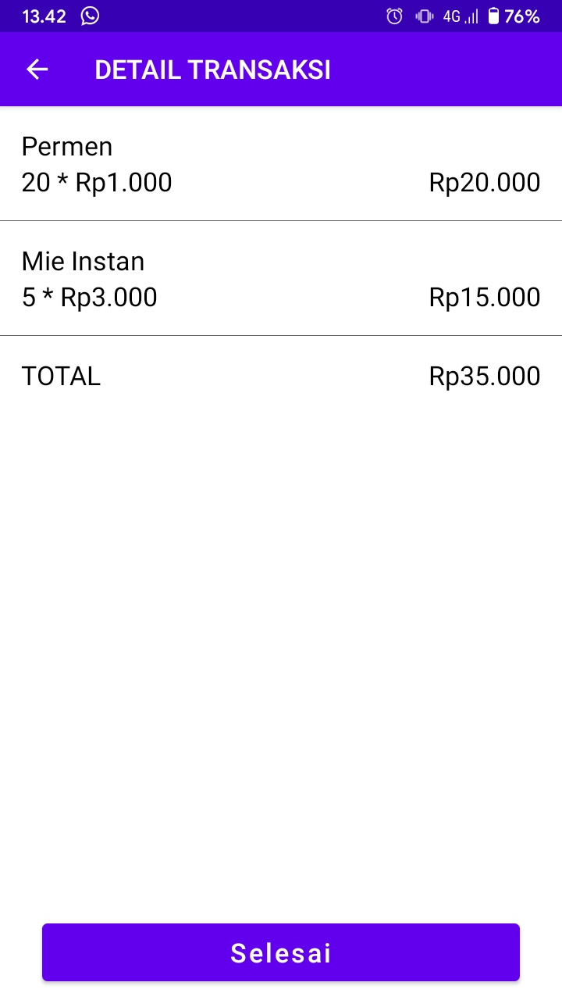
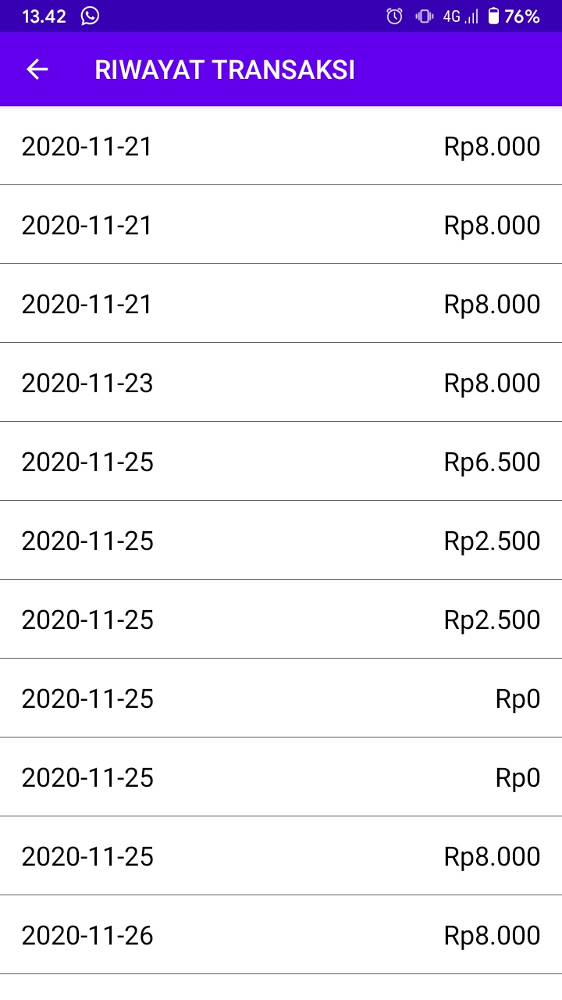

# AplikasiKasir
Aplikasi kasir sederhana android yang dibangun menggunakan bahasa kotlin dan menggunakan struktur MVVM serta terkoneksi dengan Rest Api demo dari energeek

### Fitur
- Menambahkan produk yang akan dijual (hanya bisa dilakukan jika total harga > 0)
- Melihat riwayat transaksi
- Melihat detail transaksi

### Cara Penggunaan
1. clone repo
```
$ git clone https://github.com/bailram/AplikasiKasir.git
```
2. buka android project folder dengan Android Studio
3. build project
4. masukkan username = kasir dan password = kasir pada aplikasi

### Screenshot











